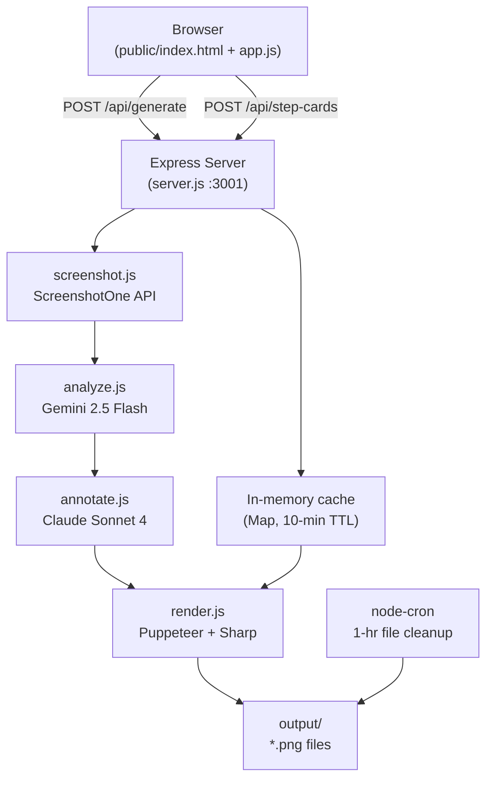

<!-- generated-by: gsd-doc-writer -->
# AnnotatorAI — Architecture

## System Overview

AnnotatorAI is a Node.js/Express web application that accepts a URL and an optional focus hint, then runs a four-stage AI pipeline to produce annotated social media card images. The system has no database; state between requests lives in a short-lived in-memory cache (10-minute TTL). Output images are stored on disk and auto-deleted after one hour.

The server runs as a single process managed by PM2 on a Hostinger Ubuntu 22.04 VPS, exposed on port 3001 in production.

## Component Diagram



## Data Flow

### Overview Card Generation (`POST /api/generate`)

1. **Input validation** — `server.js` normalises the URL (prepends `https://` if missing), validates it with `isValidUrl`, and sanitises the focus hint (max 100 chars).
2. **Screenshot capture** (`src/screenshot.js`) — Calls the ScreenshotOne API with viewport 1200×800, full-page PNG, ads and cookie banners blocked. Retries once on failure. Returns a base64-encoded PNG.
3. **Crop to visible area** (`src/utils.js` → `cropToVisibleArea`) — Sharp trims the screenshot to the height that will actually be visible in the card's 936×520 screenshot slot, so Gemini's coordinate analysis aligns with the rendered image.
4. **Vision analysis** (`src/analyze.js`) — Sends the cropped base64 PNG to Gemini 2.5 Flash with a structured JSON schema. Returns `pageTitle`, `pageTopic`, `detectedFocus`, and 3–5 `elements` each with label, description, and bounding box percentages (`x_percent`, `y_percent`, `w_percent`, `h_percent`).
5. **Annotation copy** (`src/annotate.js`) — Sends the analysis JSON to Claude Sonnet 4 (`claude-sonnet-4-5`). Returns `cardTitle`, `cardSubtitle`, and one `step` object per element.
6. **Card render** (`src/render.js`) — Injects all data into `templates/card.html` via string replacement, launches a headless Puppeteer browser, captures a 1080×1920 PNG, compresses it with Sharp (compression level 9), and writes it to `output/<uuid>.png`.
7. **Cache + response** — The analysis and annotation data are stored in the in-memory `generationCache` keyed by the output filename. The client receives the image URL and step count.

### Step Cards Generation (`POST /api/step-cards`)

Triggered by the client after the overview is displayed, using the `overviewId` (overview filename) returned in the previous step.

1. Looks up the generation data from `generationCache`.
2. For each step/element pair, `cropElement` in `src/render.js` extracts a square crop of the original screenshot centred on the element's bounding box (2.5× the element dimensions, minimum 25% of image width).
3. The crop is injected into `templates/step-card.html` and rendered as a 1080×1080 PNG via Puppeteer.
4. All step card filenames are returned as an array of URLs.

### ZIP Download (`POST /api/download-all`)

Accepts an array of output file paths, validates each name against `^[\w-]+\.png$`, streams a zip archive directly to the HTTP response using `archiver`.

## Key Abstractions

| Module | Responsibility |
|--------|---------------|
| `src/screenshot.js` | Thin wrapper around `screenshotone-api-sdk`. Handles auth, options, and one retry. |
| `src/analyze.js` | Gemini 2.5 Flash vision call with schema-enforced JSON output. Chooses between a focus-aware and a generic prompt. |
| `src/annotate.js` | Claude Sonnet 4 copy call. Produces card title, subtitle, and step copy from analysis JSON. |
| `src/render.js` | All Puppeteer and Sharp logic. `renderCard` produces the 1080×1920 overview; `renderStepCards` loops over elements to produce 1080×1080 zoomed step cards. Each call launches and closes its own browser instance. |
| `src/utils.js` | Shared helpers: `withJsonRetry` (strips markdown fences, JSON.parse with retry), `withTimeout` (Promise.race wrapper), `cropToVisibleArea` (Sharp crop), `cleanupOldFiles` (1-hour TTL), `isValidUrl`, `sanitizeFocus`. |
| `templates/card.html` | Self-contained HTML + inline CSS for the overview card. Rendered at 1080×1920 by Puppeteer. Placeholders are `{{TOKEN}}` strings replaced at runtime. |
| `templates/step-card.html` | Self-contained HTML + inline CSS for each step card. Rendered at 1080×1080 by Puppeteer. Same placeholder convention. |
| `server.js` | Express 5 entry point. Mounts all routes, runs cron cleanup, holds the in-memory generation cache. |

### Error Handling Patterns

- `withJsonRetry(apiFn, maxAttempts)` — retries AI calls up to 2 times and strips markdown code fences before `JSON.parse`.
- `withTimeout(promise, ms, label)` — wraps the full pipeline in a 60-second race; step cards get 120 seconds.
- Screenshot capture has its own explicit 2-attempt retry loop.
- Express 5 error middleware (4-parameter signature) catches unhandled errors.

### In-memory Cache

`generationCache` is a plain `Map` in the server process. Each entry holds `{ annotationData, screenshotBase64, analysisData, url }` and is auto-expired after 10 minutes via `setTimeout`. This means step cards cannot be generated more than 10 minutes after the overview — a deliberate tradeoff to avoid disk accumulation.

## Directory Structure Rationale

```
annotatorai/
├── server.js               # Express app, routes, cache, cron
├── src/
│   ├── screenshot.js       # Stage 1 — capture
│   ├── analyze.js          # Stage 2 — vision analysis
│   ├── annotate.js         # Stage 3 — copy generation
│   ├── render.js           # Stage 4 — image rendering
│   └── utils.js            # Shared utilities
├── templates/
│   ├── card.html           # Overview card template (1080×1920)
│   └── step-card.html      # Step detail card template (1080×1080)
├── public/
│   ├── index.html          # Single-page frontend
│   ├── app.js              # Vanilla JS: form submit, polling, gallery
│   └── style.css           # Frontend styles
├── output/                 # Runtime PNG output (auto-cleaned after 1 hr)
├── ecosystem.config.js     # PM2 config (port 3001, watch: false)
└── package.json
```

- `src/` contains only the four pipeline stages and shared utilities, keeping each stage independently testable (see `test-screenshot.js`, `test-analyze.js`, `test-annotate.js`, `test-puppeteer.js` in the project root).
- `templates/` are pure HTML files — no build step, no templating engine. String replacement in `render.js` keeps the rendering path simple.
- `public/` is served as static files by Express; no bundler required.
- `output/` is also served as static files (`/output/:file`) so the browser can display generated images directly.

## Infrastructure Notes

<!-- VERIFY: Hostinger VPS at 82.29.160.5 running Ubuntu 22.04 -->
- Production port is **3001** (set in `ecosystem.config.js`), coexisting with other Docker-based services on the same VPS.
- PM2 manages the process with `autorestart: true`, `watch: false`, and a 1 GB memory restart threshold.
- Puppeteer is launched with `--no-sandbox`, `--disable-setuid-sandbox`, `--disable-dev-shm-usage`, and `--disable-gpu` — required flags for headless Chrome on a Linux VPS without a display server.
- Each card render launches and closes a fresh Puppeteer browser instance (not pooled). This is acceptable for low-concurrency hackathon use; high concurrency would require a browser pool.
- Output files are cleaned up every 10 minutes by a `node-cron` job (files older than 1 hour are deleted).
